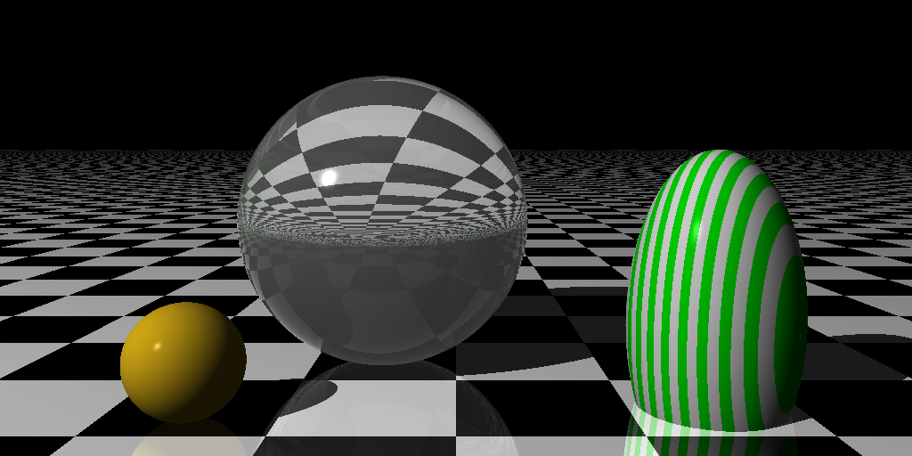
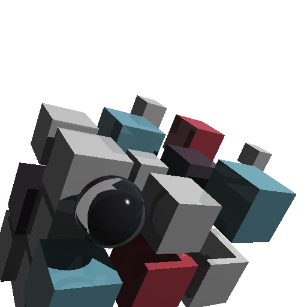

# pytracer - My python raytracer

Huge thanks to Jamis Buck for his incredible book that inspired and guided this project.
I am using pytest to run the unit tests, and only the built-in python libraries other than that.

# Some examples
## Testing refraction

## Replicating the cover image

